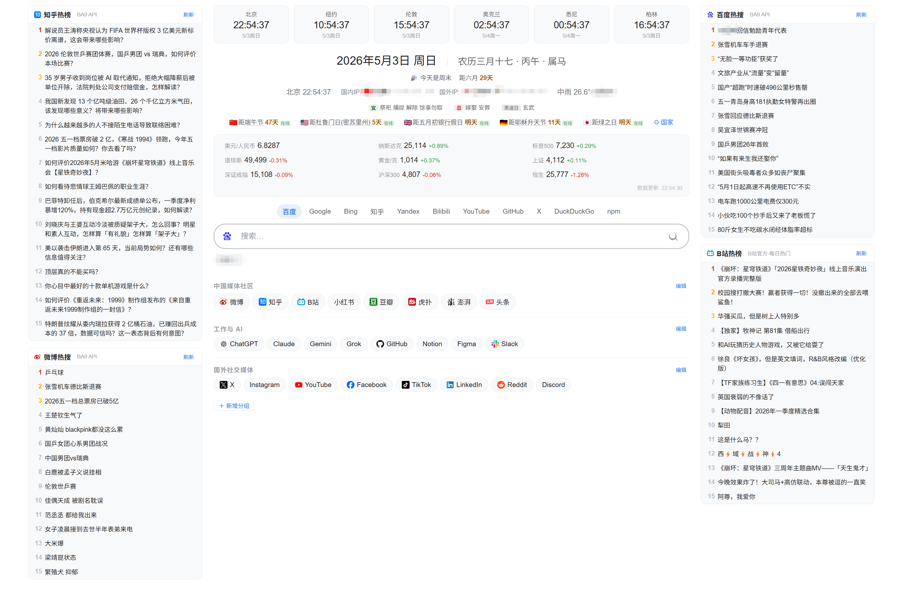

# lite-nav

> 轻量级个人/团队导航主页:农历、多国节假日、实时行情、热榜聚合
> 多源容灾,永不返回空。自部署 / 内网 / 本地皆可。

**在线演示:[litenav.info](https://litenav.info)**

[](https://litenav.info)
[](LICENSE)
[](https://github.com/PazzIFirst/lite_nav/releases)
[](https://github.com/PazzIFirst/lite_nav/actions/workflows/docker-publish.yml)
[](https://hub.docker.com/r/pazzifirst/lite-nav-backend)


一个符合中国大陆用户使用习惯的轻量级导航主页。无外部前端框架、单文件前端;后端可选(放弃后端会失去多源 fallback、缓存与跨设备一致性,但仍可单文件本地用)。

A self-hostable lightweight navigation homepage tuned for users in mainland China — featuring lunar calendar, almanac, multi-country holidays, live finance & social-media hot lists. Multi-source fallback that never returns empty.



---

## 系统要求

| 项 | 最低 | 推荐 |
|---|---|---|
| CPU | 1 vCPU | 1 vCPU |
| 内存 | 512 MB | 1 GB |
| 磁盘 | 5 GB | 10 GB |
| 操作系统 | 任意装得上 Docker 的 Linux 发行版 | Ubuntu 22.04+ / Debian 12+ |
| Docker | Docker Engine 24+,Compose v2 | 同 |
| 网络 | 任意 | 服务器在境外(东京/新加坡/美西等)直连境外 API 更顺畅 |

**实际运行占用(三个容器空闲态)**:

```
nav-backend         约 120 MB RAM
Redis               约  30 MB RAM
OpenResty           约  30 MB RAM
合计                约 180 MB RAM,CPU < 1%
```

**镜像体积**:nav-backend ≈ 250 MB(Node 20-alpine + 依赖 + 构建时打包的节假日数据)。
**带宽**:单个用户首次访问约 80 KB(HTML + 几个 API);定时任务每 30 秒自拉一次行情(< 5 KB)。

---

## 核心特性

### 信息聚合

- **6 城市时钟** — 默认北京/纽约/伦敦/东京/悉尼/迪拜,可换成任意 IANA 时区
- **公历 + 农历 + 节气 + 老黄历** — 含干支纪年、生肖、宜忌(取前 5)、神位(喜/财/福)、黄黑道、彭祖百忌、纳音、冲煞;鼠标悬停查看详情
- **多国法定节假日** — 默认中美英德日,可换 20 国(含韩/法/泰/澳/俄/印/巴西等),全部中文显示,悬停看原文,**点击复制原文**
- **实时金融行情** — USD/CNY 汇率、A 股(上证/深证/沪深 300)、港股恒生、美股(纳指/标普/道指)、上海金现货
- **天气** — 自动检测 IP 城市 + 两个用户自定义城市;**国内 446 城**优先用国家气象局数据(中雨准确显示,不再"晴"反差)
- **国内外双 IP** — 同时显示访客的国内出口 IP 和国外出口 IP,适合用代理的用户校验
- **22 个热榜任选** — 页面右上角齿轮进「热榜设置」,四个槽位(左上/左下/右上/右下)各自下拉选榜,可留空
- **10 搜索引擎** — 百度 / Google / Bing / 知乎 / Yandex / Bilibili / YouTube / GitHub / X / DuckDuckGo / npm,带联想 + 历史
- **可编辑导航分组** — localStorage 存,每个浏览器独立
- **倒计时** — 周末 / 各国节假日 / 距月初

### 工程亮点

| 亮点 | 实现 |
|---|---|
| 永不返回空 | 每类数据 3-6 层 fallback;最坏情况返回 lastgood 缓存或内置兜底 |
| 三态读取 | `fresh` / `stale` / `fallback` 在响应里明确标记,前端展示状态 |
| 每条数据带数据源 | 鼠标悬停看到 "数据源: 东方财富 · 更新: 30 秒前 · 状态: 新鲜" |
| 多源并行合并 | 行情数据并行调东方财富 + 新浪 + 腾讯,每个数据点独立选最优源 |
| stale-while-revalidate | 旧数据立即返回,后台异步刷新 |
| 农历完全离线 | `lunar-javascript` 纯算法,无外网依赖,2030 年仍可用 |
| 节假日 5 层 fallback | 在线 API 至 CDN 至**镜像内打包**(2026-2030) 至 npm 离线包 至 算法推算关键节日 至 内置 |
| 0 SQL 依赖 | 用户偏好走 localStorage,共享数据走 Redis |

---

## 快速开始

### 部署步骤(以 1Panel 为例,5 分钟)

```bash
# 1. 克隆
git clone https://github.com/PazzIFirst/lite_nav.git
cd lite_nav

# 2. 配置后端
cp backend/docker-compose.yml.example backend/docker-compose.yml
# 编辑 backend/docker-compose.yml,改 REDIS_HOST / REDIS_PASSWORD
# 注意:1Panel 的 Redis 容器名通常是 1Panel-redis-XXXX,网络是 1panel-network

# 3. 起后端(默认 pull 预构建镜像,无需本地 build)
cd backend
docker compose up -d
# 想改源码自己 build → 编辑 docker-compose.yml,把 image: 注释掉,改用 build: .
# 看日志确认 OK
docker logs nav-backend --tail 20

# 4. 在 1Panel UI 创建网站(类型选「静态」),申请 Let's Encrypt SSL

# 5. 部署前端 + 注入反代配置(把 nav.example.com 换成你的域名)
cd ../deploy
sudo bash deploy-after-1panel-site.sh nav.example.com
# 脚本会自动检测 OpenResty 容器名;如未识别可显式指定:
# sudo bash deploy-after-1panel-site.sh nav.example.com 1Panel-openresty-XXXX
```

预构建镜像在 Docker Hub:[`pazzifirst/lite-nav-backend`](https://hub.docker.com/r/pazzifirst/lite-nav-backend)
支持架构:`linux/amd64` + `linux/arm64`(树莓派、Apple Silicon 等也能跑)
更新到最新版:`docker compose pull && docker compose up -d`

### 部署步骤(普通 Nginx / Caddy)

不用 1Panel,改用普通 Nginx:

```bash
# 1-3 同上

# 4. 把整个 frontend 目录复制到网站根(包含 css/js/flags/robots.txt/sitemap.xml)
sudo cp -r frontend/* /var/www/html/

# 5. 在 Nginx 站点配置里追加 location /api/(参考 deploy/openresty-api-snippet.conf.example)
location /api/ {
    proxy_pass http://127.0.0.1:3000;
    proxy_set_header Host $host;
    proxy_set_header X-Real-IP $remote_addr;
}

# 6. reload
sudo nginx -s reload
```

### 套 Cloudflare 橙云代理(可选,推荐)

免费拿到 CDN 加速、DDoS 防护、免费 SSL、隐藏源站 IP,且**前后端仍同源** —— `/api/*` 零配置,前端一行不用改。

> **不建议用 Cloudflare Pages 托管前端。** Pages 是纯静态托管,没有反代,`/api/*` 得额外写 Pages Functions 转发回你的服务器 —— 多一跳延迟、多一份代理代码要维护,还要受 Functions 请求配额约束(前端行情 30 秒轮询一次,**单个常开标签页约 3200+ 次/天**)。既然已经有服务器,橙云代理是更简单也更快的选择。
>
> 至于把后端本身搬上 Workers:`express` / `ioredis` / `node-cron` / `node:fs` / `iconv-lite`(新浪腾讯行情是 GB18030 编码)五处都依赖 Node 运行时,等于重写整个后端,不在本项目支持范围内。

```bash
# 1. 域名 NS 指向 Cloudflare(在 CF 添加站点后按提示改注册商的 NS)

# 2. CF DNS 里加 A 记录指向你的服务器公网 IP,代理状态选「已代理」(橙色云朵)

# 3. SSL/TLS 加密模式选「完全(严格)」
#    源站需有有效证书 —— 1Panel 申请的 Let's Encrypt 即可
#    切勿选「灵活」:CF 到源站会走明文 HTTP,且源站 443 已有证书时会造成重定向循环

# 4. 关键:让源站还原访客真实 IP
sudo cp deploy/cloudflare-realip.conf.example /path/to/openresty/conf/cloudflare-realip.conf
#    在站点 server 块里 include 它,然后 reload
```

**必须做的两步,漏了会出问题:**

| 步骤 | 漏了的后果 |
|---|---|
| include `cloudflare-realip.conf` | 源站只看到 CF 边缘节点 IP → `/api/ip` 显示错误位置;**限流退化成全体访客共用一个桶** |
| 后端 `TRUST_PROXY=1` | 同上 —— OpenResty 仍以反代身份转发给 nav-backend |

`cloudflare-realip.conf.example` 用 `set_real_ip_from` 限定只有来自 CF 网段的 `CF-Connecting-IP` 头才作数。**不要图省事直接写 `proxy_set_header X-Forwarded-For $http_cf_connecting_ip`** —— 那等于无条件信任一个客户端可伪造的头,源站 IP 一旦泄露(历史 DNS 记录、邮件头、证书透明日志都可能泄),攻击者可绕过 CF 直连源站伪造该头,污染 `/api/ip` 并把限流键刷成任意值绕过限流。

验证是否生效:

```bash
# 从外网访问一次,再看后端日志里的 IP 是不是你的真实出口 IP
curl -s https://your-domain/api/ip | python3 -m json.tool
# visitor_ip 应为你的公网 IP,而不是 104.x / 172.64.x 等 CF 网段地址
```

CF 网段偶尔会变,建议每年核对一次(命令见该文件头部注释)。

### 本地试用

前端用 ES Modules,**不能** `file://` 双击打开(浏览器 CORS 限制)。要本地试用,起一个简单 HTTP server:

```bash
cd frontend
python3 -m http.server 8080
# 浏览器打开 http://localhost:8080
```

无后端时前端会因 `/api/*` 调用失败而退化(农历/节假日/行情/热榜/天气看不到),搜索/城市时钟/导航分组仍可用。

要正常用,后端必须跑起来。

---

## 架构

```
浏览器
  | HTTPS
  v
反代 (OpenResty / Nginx / Caddy)
  +-- /              -->  frontend/index.html  静态文件
  +-- /api/*         -->  127.0.0.1:3000  (nav-backend Docker 容器)
                            |
                            +-- node-cron 定时任务
                            |     - 行情每 30s
                            |     - 热榜每 5min
                            |     - 节假日每天 03:00
                            |     - 今日(农历)每天 00:01
                            |
                            +-- 三方 API
                            |     - 东方财富 / 新浪 / 腾讯(行情)
                            |     - Open-Meteo / wttr.in / 中国天气网(天气)
                            |     - Nager.Date / date-holidays / timor.tech(节假日)
                            |     - BA9 / VVHAN / B站官方(热榜)
                            |     - 百度 / Google / Bing(搜索联想)
                            |
                            +-- Redis (cache: + lastgood: 双键)
```

---

## 数据源清单

### 节假日

| 国家 | 主源 | 备 1 | 备 2 | 离线兜底 |
|---|---|---|---|---|
| CN | timor.tech | NateScarlet/holiday-cn (CDN) | **镜像内打包**(2026-2030,有数据的年份) | 算法推算(春节/端午/中秋等农历日) + 内置 |
| US/GB/DE/JP/FR/KR/CA/AU/SG/IN/IT/ES/RU/BR/NL/CH/TH/MY/NZ | Nager.Date API | date-holidays npm(完全离线) | — | — |

所有非中文节日名经过手工翻译(覆盖联邦/州/邦级 700+ 条目,如 `Truman Day` → 杜鲁门日(密苏里州)、`Vesak Day` → 卫塞节)。

### 农历 / 老黄历

- `lunar-javascript`(纯算法,寿星天文历)
- 100% 离线,无任何外网依赖

### 金融

| 数据 | 主 | 备 1 | 备 2 |
|---|---|---|---|
| 美元/人民币 | Frankfurter | ExchangeRate-API | — |
| A 股指数 | 东方财富 | 新浪财经 | 腾讯财经 |
| 港股恒生 | 东方财富 | 腾讯财经 | — |
| 美股(纳指/标普/道指) | 东方财富 | 腾讯财经 | — |
| 黄金(¥/克) | 东方财富 AU9999 | 上轮缓存继承 | — |

并行调用 + 每个数据点独立选最优源。

### 天气

| 城市类型 | 主 | 备 1 | 备 2 |
|---|---|---|---|
| 国内城市(446 内置 cityCode,覆盖全国地级市 + 主要县级) | 中国天气网 (itboy 镜像) | Open-Meteo | wttr.in |
| 国外城市 | Open-Meteo | wttr.in | — |

### 热榜

共 22 个榜单,前端四个槽位任选(默认知乎/微博/百度/B 站)。

| 分类 | 榜单 | 数据源 |
|---|---|---|
| 社交热搜 | 知乎、微博、百度 | 主源 BA9 + 备源 VVHAN |
| | B 站 | B 站官方 API ×2 + BA9 兜底 |
| | 抖音 | BA9 |
| 新闻资讯 | 今日头条、腾讯新闻、网易新闻、新浪新闻、百度贴吧 | 各家官方接口 |
| 科技数码 | IT之家、虎嗅、爱范儿、Solidot | RSS |
| | 少数派 | BA9 + 少数派 RSS |
| 开发者 | V2EX、稀土掘金、51CTO、HelloGitHub | 各家官方接口 |
| | Hacker News | 官方 API(topstories + 逐条取标题) |
| 其他 | 豆瓣热门电影、微信读书飙升 | 各家官方接口 |

**选源门槛**:只接站方官方接口、成熟第三方聚合(BA9/VVHAN)、官方 RSS。个人站点的「自用 / 仅供测试」型接口不纳入 —— 稳定性不可控,且多半带 QPS 限制与鉴权变更。需要这类源可 fork 后在 `HOT_CATALOG` 里自行添加,结构与其余项相同。

榜单目录由后端 `/api/hot/catalog` 下发,前端下拉框直接据此生成,不会和后端脱节。

**刷新策略**:cron 定时刷「默认四榜 + 近 1 小时被访问过的榜」;冷门榜由 `/api/hot/:id` 缓存缺失时按需拉取(带 in-flight 去重),避免 22 个榜全量轮询。

---

## 配置

### 后端环境变量(`backend/docker-compose.yml`)

#### 必需

| 变量 | 默认 | 说明 |
|---|---|---|
| `PORT` | 3000 | 后端监听端口 |
| `HOST` | 0.0.0.0 | 监听 host(可改 127.0.0.1 仅本地) |
| `REDIS_HOST` | redis | Redis 主机/容器名 |
| `REDIS_PORT` | 6379 | Redis 端口 |
| `REDIS_PASSWORD` | (无) | Redis 密码 |
| `TZ` | Asia/Shanghai | 时区 |

#### 可选(安全 / 限流)

| 变量 | 默认 | 说明 |
|---|---|---|
| `CORS_ORIGIN` | 空 | 逗号分隔的允许 origin。同域反代不需要;跨域才填 |
| `RATE_LIMIT_PER_MIN` | 120 | `/api/*` 全局限流 |
| `REFRESH_LIMIT_PER_MIN` | 5 | `/api/hot/x/refresh` 单独限流 |
| `REFRESH_TOKEN` | 空(接口禁用) | 配置后 POST 刷新接口需带 `X-Refresh-Token` 头 |

#### 可选(缓存 / 抓取)

| 变量 | 默认 | 说明 |
|---|---|---|
| `DYNAMIC_LASTGOOD_TTL_SEC` | 2592000 | 天气等动态 key 的 lastgood TTL(30 天) |
| `FETCH_MAX_BODY_BYTES` | 2097152 | 第三方响应最大 body(2MB) |
| `PACKED_HOLIDAY_DIR` | /app/data/holiday-cn | 容器内节假日数据路径 |

### 前端用户偏好(浏览器 localStorage,无需配置)

| Key | 含义 |
|---|---|
| `clockCities` | 6 城市时钟列表 |
| `wxCity1` / `wxCity2` | 自定义天气城市 |
| `searchHistory` | 搜索历史(最多 10 条) |
| `navGroups` | 自定义导航分组 |
| `countdownCountries` | 倒计时显示的国家代码列表 |
| `hotSlots` | 四个热榜槽位的榜单 id,顺序为 左上/左下/右上/右下,空串表示不显示 |

清掉 localStorage 即恢复默认。

---

## 二次开发

### 目录结构

```
lite-nav/
+-- README.md
+-- LICENSE                 # MIT
+-- CHANGELOG.md
+-- .gitignore
+-- frontend/                       # 静态资源(零构建,ES Modules)
|   +-- index.html                  # 骨架 + SEO meta + JSON-LD,约 200 行
|   +-- robots.txt
|   +-- sitemap.xml
|   +-- css/
|   |   +-- main.css                # 全部样式
|   +-- js/                         # ES Modules,浏览器原生 import
|   |   +-- api.js                  # fetchT / apiGet / srcTooltip / safeHttpUrl / copyToClipboard
|   |   +-- search.js               # 10 引擎 + 历史 + 联想
|   |   +-- clocks.js               # 6 城市时钟 + 编辑弹窗
|   |   +-- today.js                # 公历/北京时间 + 农历 + 老黄历
|   |   +-- holidays.js             # 多国节假日 + 倒计时 + 国家选择
|   |   +-- ip-weather.js           # IP 检测 + 天气联动 + 天气弹窗
|   |   +-- finance.js              # 行情 + 双汇率 + 市场状态徽章
|   |   +-- hot.js                  # 热榜面板
|   |   +-- nav.js                  # 导航分组 + 站点弹窗
|   |   +-- main.js                 # 入口,串联各模块 + Page Visibility 轮询
|   +-- flags/                      # 20 国本地国旗 PNG
+-- backend/
|   +-- Dockerfile
|   +-- docker-compose.yml.example
|   +-- package.json
|   +-- src/
|       +-- server.js               # Express 路由
|       +-- scheduler.js            # node-cron 定时任务
|       +-- redis.js                # 三态读写封装
|       +-- fetcher.js              # 主备链 + runAndCache
|       +-- safe.js / validators.js # 输出清洗 + 输入校验
|       +-- sources/
|           +-- finance.js          # 行情(并行多源)+ Yahoo USDCNY/CNH 双汇率
|           +-- hot.js              # 热榜
|           +-- weather.js          # 天气(中国天气网 + Open-Meteo + wttr)
|           +-- data/cn-cities.json # 446 城 cityCode
|           +-- holiday.js          # 多国节假日 + 5 层 fallback
|           +-- holiday-i18n.js     # 翻译 loader
|           +-- i18n/               # 21 个 JSON: common + 20 国
|           +-- today.js            # 农历 / 节气 / 老黄历
|           +-- suggest.js          # 搜索联想
|           +-- ip.js               # /api/ip 备用代理
+-- deploy/
|   +-- openresty-api-snippet.conf.example
|   +-- cloudflare-realip.conf.example   # 套 CF 橙云时还原访客真实 IP
|   +-- deploy-after-1panel-site.sh
+-- docs/
|   +-- screenshot.png
|   +-- dockerhub-overview.md       # Docker Hub Overview 同步源
+-- .github/workflows/
    +-- docker-publish.yml          # 自动构建 + 推 Docker Hub
    +-- dockerhub-description.yml   # 同步 overview 到 Docker Hub
```

### 加新国家(节假日)

1. 在 `backend/src/sources/holiday.js` 的 `SUPPORTED_COUNTRIES` 数组加一行
2. 在 `backend/src/sources/i18n/` 下新建 `<code>.json`(小写国家代码),内容是 `{ "原文": "中文", ... }`
3. 重启容器(`docker compose restart` 即可,无需 rebuild,JSON 是运行时加载)

### 改翻译

直接编辑 `backend/src/sources/i18n/<code>.json`,加 / 改键值对,`docker compose restart` 即生效。

### 加新数据源

每个 source 是一个返回 `Promise<data | null>` 的函数。失败抛错或返回 `null` 即可,主备链会自动 fall through。模板:

```js
async function fromMyApi(/* args */) {
  const r = await fetchT('https://...', { timeout: 5000 });
  const d = await r.json();
  if (!d?.expected_field) return null;
  return /* normalized data */;
}
```

### 自己发布到 Docker Hub(可选,Fork 后想推自己的镜像时)

仓库自带 GitHub Actions workflow `.github/workflows/docker-publish.yml`,默认在以下情况触发:

- 推 `main` 分支(且 `backend/` 有改动)→ 发布 `:latest`
- 推 `v*` 标签(如 `git tag v1.0.0 && git push --tags`)→ 同时发布 `:latest` `:1.0.0` `:1.0`
- 在 Actions 页面手动点 Run workflow

需要配置两个 secret(GitHub repo Settings → Secrets and variables → Actions → New repository secret):

| Secret | 值 |
|---|---|
| `DOCKERHUB_USERNAME` | 你的 Docker Hub 用户名 |
| `DOCKERHUB_TOKEN` | Docker Hub Access Token([这里生成](https://hub.docker.com/settings/security)) |

镜像仓库会推到 `<你的 DOCKERHUB_USERNAME>/lite-nav-backend`。配置好后,`docker-compose.yml.example` 里的 `image: pazzifirst/lite-nav-backend:latest` 改成你自己的用户名即可。

### 改前端

`frontend/` 是 ES Modules 模块化结构,改完直接 cp 覆盖部署目录:

```bash
sudo cp -r frontend/* /opt/1panel/apps/openresty/openresty/www/sites/<your-domain>/index/
```

各模块职责清晰(见上方目录结构),改 IP 检测就只动 `js/ip-weather.js`,改行情就只动 `js/finance.js`,不会误触别处。无需重启任何服务,浏览器 Ctrl+F5 即生效。

### SEO

- `<head>` 含完整 Open Graph / Twitter Card / 结构化数据(Schema.org `WebApplication` JSON-LD)
- `frontend/robots.txt` 允许爬虫;`frontend/sitemap.xml` 列出主页
- 项目卖点通过 `<header class="seo-only">` 写入 HTML 静态部分,对爬虫可见但视觉隐藏
- 若你部署到自己的域名,记得修改 `index.html` 内的 `og:url` / `canonical` / `og:image` 和 `robots.txt` 内的 sitemap URL

---

## FAQ

**Q: 为什么没有数据库?**

A: 用户偏好(导航分组、搜索历史等)走浏览器 localStorage,共享数据(行情、热榜)走 Redis。引入 SQL 没有任何收益。

**Q: 我的服务器在境外,某些国内 API 是不是会拿不到数据?**

A: 后端已尽量挑可访问性好的源(东方财富、Nager.Date 都全球可达)。如果某条 API 在你境外服务器上 DNS 解析失败,fallback 链自然跳到下一家。境外服务器实测全功能可用。

**Q: 怎么换默认导航分组?**

A: 改 `frontend/js/nav.js` 里 `DEFAULT_NAV` 数组。已有用户的浏览器仍会读 localStorage,需手动清掉才看到新默认。

**Q: 怎么不让某个数据源被用?**

A: 在 `backend/src/sources/<x>.js` 里把对应 source 从数组里删掉/注释掉。

**Q: 黄金为什么是 ¥/克?**

A: 东方财富 AU9999 是上海金交所现货,单位 ¥/克(不是 USD/盎司)。中国用户更熟悉这个价位。如要切到 COMEX 国际金价,改 secid 为 `100.GC00Y`。

**Q: 节假日怎么知道是 2030 年也准?**

A: 算法层用 `lunar-javascript` 推算春节/端午/中秋等农历节日的公历日期(永远准),不准的部分是**调休** —— 那个由国务院前一年公告,任何方案都做不到提前 5 年;但你能算出"距 2030 年春节多少天"。

**Q: 我的城市不在 446 里怎么办?**

A: 自动 fallthrough 到 Open-Meteo,功能不丢失,只是国内小县/区天气精度略低。也欢迎 PR 补 cityCode。

---

## 贡献

欢迎 PR。特别欢迎:

- 补全 `holiday-i18n.js` 的小语种节日翻译
- 加更多国家的节假日(目前 20 国)
- 修各种数据源拼写/字段变化
- 补 `weather.js` 的 cityCode 表(覆盖更多县/区)

PR 前请:

1. 确保后端 `docker compose up -d --build` 不报错
2. 确保前端 `index.html` 在浏览器里能正常加载(F12 看控制台无错误)

---

## License

[MIT](LICENSE)

本项目使用 MIT 协议:可自由使用、修改、分发、商用,无需开源衍生作品,仅需保留版权声明。

---

## 鸣谢

数据源:

- [东方财富](https://www.eastmoney.com/) / [新浪财经](https://finance.sina.com.cn/) / [腾讯财经](https://qq.com) — 行情
- [Frankfurter](https://www.frankfurter.app/) / [ExchangeRate-API](https://www.exchangerate-api.com/) — 汇率
- [Open-Meteo](https://open-meteo.com/) / [wttr.in](https://wttr.in) / [中国天气网](http://www.weather.com.cn) — 天气
- [timor.tech](https://timor.tech/) / [NateScarlet/holiday-cn](https://github.com/NateScarlet/holiday-cn) / [Nager.Date](https://date.nager.at/) — 节假日
- [api.ba9.cn](https://api.ba9.cn) / [VVHAN API](https://api.vvhan.com) / B 站官方 API — 热榜
- [Memoyu/ChinaWeatherCityCode-JSON](https://github.com/Memoyu/ChinaWeatherCityCode-JSON) — 中国天气网 cityCode 数据集

库:

- [lunar-javascript](https://github.com/6tail/lunar-javascript) — 农历/节气/老黄历(MIT)
- [date-holidays](https://github.com/commenthol/date-holidays) — 多国节假日(ISC)
- [express](https://expressjs.com/) / [ioredis](https://github.com/redis/ioredis) / [node-cron](https://github.com/node-cron/node-cron) / [iconv-lite](https://github.com/ashtuchkin/iconv-lite)

---

如果这个项目对你有用,欢迎 Star。
